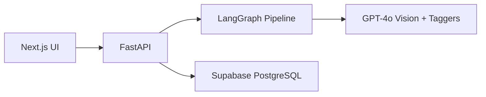

# Image Analysis Agent — AI-Powered Product Image Tagging System

## Tags

`LangGraph` `GPT-4o` `FastAPI` `Next.js` `React` `TypeScript` `Supabase` `PostgreSQL` `LangChain` `Pydantic` `Docker` `Tailwind CSS` `shadcn/ui` `AI Agent` `Computer Vision` `Prompt Engineering`

---

## My Role

**Solo developer** — designed the architecture, built the full stack (backend, frontend, database, Docker), engineered all prompts.

---

## Problem

Product companies manage thousands of images that need consistent, structured tagging across categories like season, theme, colors, objects, mood, occasion, design elements, and product type. Manual tagging is slow, inconsistent, and does not scale. Existing auto-tagging tools produce flat labels without confidence scores, validation, or structured taxonomy enforcement.

---

## Approach

Built a full-stack AI agent that uses a **LangGraph DAG pipeline** with 12 nodes: a preprocessor resizes and validates the image, a GPT-4o vision call produces a structured description, then **8 parallel taggers** (one per category) run on the text description using a controlled taxonomy of allowed values. A validator checks every tag against the taxonomy (flat and hierarchical), a confidence filter applies per-category thresholds, and an aggregator produces a final TagRecord. Results are persisted in PostgreSQL (Supabase) with a flattened search index for fast multi-category AND queries. The frontend provides single upload with real-time analysis, bulk upload with background processing and polling, and a search page with cascading filters.



---

## Key Metrics

| Metric | Value |
|--------|-------|
| Pipeline nodes | 12 (preprocessor, vision, 8 taggers, validator, confidence, aggregator) |
| Tag categories | 8 (season, theme, objects, colors, design, occasion, mood, product type) |
| Taxonomy values | 50+ allowed values across flat and hierarchical categories |
| Parallel taggers | 8 running concurrently via LangGraph Send API |
| API endpoints | 9 (health, taxonomy, analyze, tag-image, tag-images, search, filters, bulk-upload, bulk-status) |
| Frontend components | 15+ React components with dark/light theme |

---

## Screenshots

<!-- Add your screenshots here -->

---

## Results

- Structured tags across **8 categories** with per-tag confidence scores and automatic needs-review flagging.
- **Parallel tagger execution** via LangGraph Send API reduces latency compared to sequential calls.
- **Search with AND logic** across categories using PostgreSQL array containment (`@>`), with cascading filter options so users never see empty results.
- Bulk upload with background processing and live polling progress.
- Full Docker deployment (backend + frontend) with one command (`docker compose up --build`).

---

## Challenges and Solutions

| Challenge | Solution |
|-----------|----------|
| LLMs return tags outside the allowed taxonomy | Double filtering: the prompt lists allowed values, and the code filters the output to only allowed values with confidence > 0.5 |
| Vision API calls are expensive and slow | One vision call produces a text description; all 8 taggers run on text only (no image), cutting token cost by ~8x |
| LLM responses sometimes wrapped in markdown code fences | Parser strips ``` fences before json.loads so both raw JSON and fenced JSON are handled |
| Network/API failures during analysis | Retry with exponential backoff (1 s, 2 s) up to 3 attempts; on final failure, return graceful failed state instead of crashing |
| Searching across multiple tag categories efficiently | Flattened search_index (TEXT[]) with GIN index and @> containment operator for AND queries in one SQL call |
| Bulk upload blocking the server | Background task via asyncio.create_task; frontend polls for status every 2 seconds |

---

## What I Learned

- **LangGraph** — Building a DAG pipeline with StateGraph, conditional edges, fan-out via Send, and state reducers for parallel node output merging.
- **Prompt engineering** — Designing system prompts that reliably produce structured JSON from GPT-4o (vision and text-only), including confidence scales and taxonomy constraints.
- **Full-stack architecture** — Connecting a Next.js frontend to a FastAPI backend with file uploads (FormData), async processing, and database persistence.
- **Database design** — Using JSONB for flexible storage and a flattened TEXT[] array with GIN indexes for fast multi-category search.
- **Docker** — Multi-stage builds for Next.js (standalone output), compose for orchestration, and build-time environment variables.

---

## Tools Used

| Layer | Technology |
|-------|-----------|
| AI / Agent | LangGraph, LangChain, OpenAI GPT-4o (vision + text), Pydantic |
| Backend | Python, FastAPI, asyncio, Pillow (PIL) |
| Database | Supabase (PostgreSQL), psycopg2, JSONB, GIN indexes |
| Frontend | Next.js (App Router), React, TypeScript, Tailwind CSS, shadcn/ui, Framer Motion |
| DevOps | Docker, Docker Compose, multi-stage builds |
| Patterns | DAG pipeline, fan-out/fan-in parallelism, state reducers, retry with exponential backoff, prompt engineering, taxonomy-driven validation, cascading filters |
